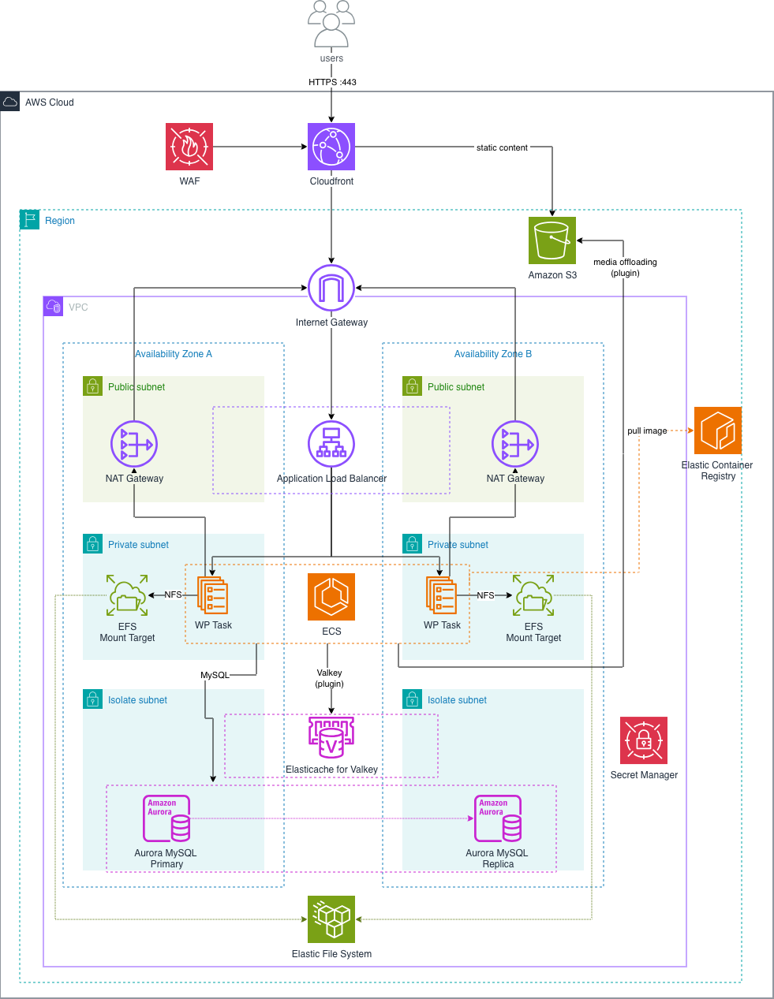

# Deploy di Wordpress su infrastruttura AWS

> Bozza iniziale README. 

---

## Contesto

<!-- TODO: 2-3 frasi rapide sui requisiti del progetto (WP parametrizzabile, sicura/veloce/fault-tolerant/scalabile, IaC su AWS, CI/CD) e sull’approccio al design della soluzione. -->

---

## Architettura

Infrastruttura multi-AZ su AWS (single regione con default su `eu-central-1`),in ambiente unico `dev` (per esecuzione in contesti enterprise da prevedere environment aggiuntivi dedicati), provisionata con Terraform.

Il traffico utente entra in HTTPS su **CloudFront + WAF** che funge da Content Delivery Network con sicurezza perimentrale e inoltra le richieste dinamiche all’**ALB** (origin) nelle subnet pubbliche. L’ALB distribuisce verso task **ECS Fargate** (WordPress Apache + PHP) nelle subnet private, su entrambe le AZ.

I task condividono il filesystem WordPress su **EFS** (mount target per AZ), parlano con **Aurora MySQL Serverless v2** (write primary + read replica) e con **ElastiCache Valkey Serverless** per object cache/sessioni (da prevedere plugin WordPress); le credenziali restano in **Secrets Manager** prevedendo rotation automatica della password DB. I media possono essere offloadati su **S3** tramite altro plugin WordPress dedicato, e serviti via CloudFront; le immagini container Docker arrivano da **ECR**. Le subnet isolate ospitano DB e cache; l’uscita internet dai privati passa da **NAT Gateway** (uno per AZ).

<!-- TODO: approfondire SG a 3 tier, autoscaling ECS, circuit breaker, bootstrap immagine ECR (`:app`). -->

---

## Stack

<!-- TODO: tabella CMS / compute / DB / cache / CDN / storage / IaC / CI. -->

---

## Prerequisiti

<!-- TODO: account AWS, Terraform, Docker, AWS CLI, permessi IAM, region. -->

---

## Installazione e prova

<!-- TODO: Spiegazione modalità di utilizzo della repository-->

---

## Razionali sulle principali scelte architetturali e trade-off

<!-- TODO: note sulla scelta dell'architettura, es. perchè ECS Fargate e non un EC2 classico, perchè S3 e Valkey (con plugin WP) per ottimizzare performance, perchè la CDN, etc. -->

---

## Considerazioni sui costi running dell'infrastruttura

<!-- TODO: note sui costi dell'infrastruttura e su scenari di applicazione -->

---

## Potenziali evolutive

<!-- TODO: introduzione allarmi, monitoraggio avanzato, Route 53, ACM, etc.-->